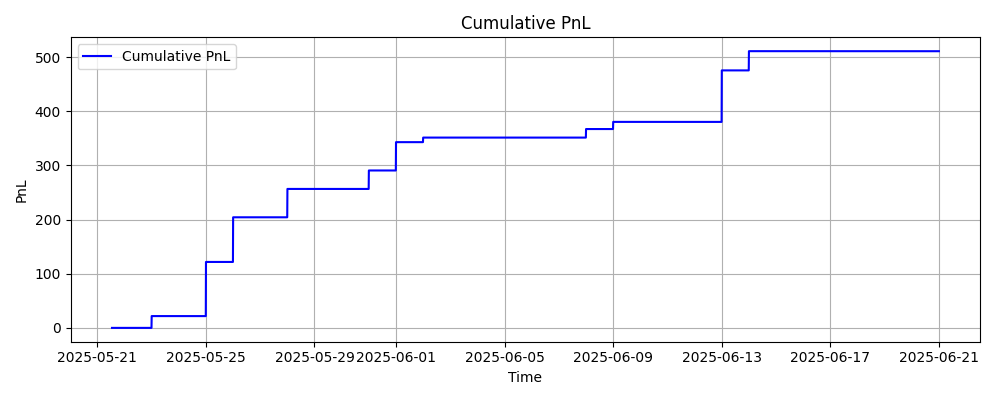
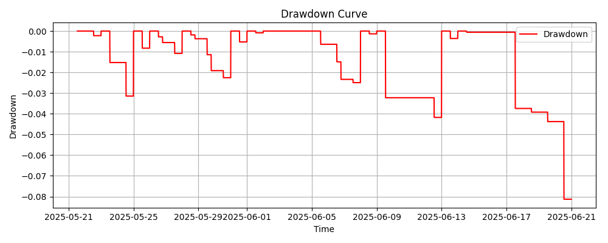
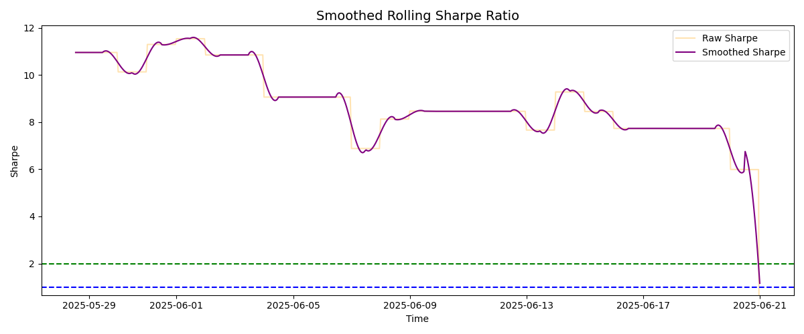
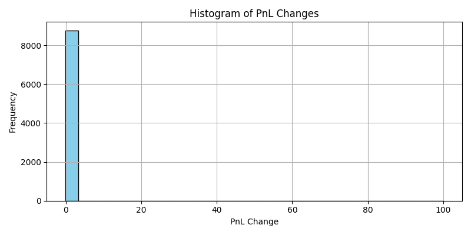

# Chicago Quant Alley — Assignment 2
### Build a Quantitative Strategy Simulator from Scratch

**Authors:**  
Vatsh Van : 24B2259   
T Sai Dheeraj : 24B0960  

---

## Table of Contents
- [Overview](#overview)
- [Simulator Module](#simulator-module)
- [Strategy Module](#strategy-module)
- [PrintStats Module](#printstats-module)
- [Sample Trades](#sample-trades)
- [Performance Plots](#performance-plots)
- [Learnings and Improvements](#learnings-and-improvements)

---

## Overview
This assignment implements a modular backtesting engine for intraday options strategies, particularly focused on short straddles. The system includes:

- **Simulator**: Executes the core trading loop using market data.
- **Strategy**: Contains the decision logic for when to enter and exit trades.
- **PrintStats**: Analyzes output data such as P&L and generates metrics and plots.

---

## Simulator Module
**File:** `Simulator.py`  
This module emulates a trading environment for options strategies. It performs the following:

- Loads historical options data and futures price series.
- Simulates trade execution with slippage.
- Tracks portfolio quantities, turnover, and realized/unrealized PnL.
- Logs each trade with timestamp, symbol, quantity, and price.

**Key Feature:**  
The simulator supports modular strategy injection, allowing any strategy class with an `onMarketData` interface to interact with the engine.

> **Note**: Always use `drop_duplicates` on `pnl_history` before saving CSVs to avoid timestamp clutter in plots.

---

## Strategy Module
**File:** `Strategy.py`  
Implements a simple intraday short straddle strategy:

- Entry at 13:00 using ATM call and put options.
- Exits when deviation in futures crosses 1% or if net PnL breaches ±500.
- Resets daily and forcefully exits positions if left open overnight.

> **Note**: In the forced exit logic, ensure that the `onOrder()` is called with correct prices to mirror real-time exit. This keeps the execution log aligned for plotting.

> **Robustness**: Failsafe conditions such as missing futures prices or incomplete data are handled with warnings and skipped execution.

---

## PrintStats Module
**File:** `printStats.py`

- Reads output CSVs: `pnl_history.csv`, `execution_log.csv`.
- Computes:
  - Final P&L, Sharpe Ratio, Max Drawdown
  - Trade-level metrics like win rate and hold time
- Generates plots:
  - P&L Curve
  - Drawdown
  - Histogram of P&L Changes
  - Entry/Exit Markers on Futures Price

---

## Sample Trades

| Symbol                        | Side | Qty | Price  |
|------------------------------|------|-----|--------|
| MARK:C-BTC-106500-240525     | SELL | 0.1 | 1303.44 |
| MARK:P-BTC-106500-230525     | SELL | 0.1 | 1303.44 |
| MARK:C-BTC-106500-240525     | BUY  | 0.1 | 11.56  |
| MARK:P-BTC-106500-230525     | BUY  | 0.1 | 11.56  |

*Table: Sample trades executed by the strategy*

---

## Performance Plots

**Cumulative PnL over time**  

**Drawdown Curve**  

**Rolling Sharpe Ratio (5-min window)**  

**Entry/Exit points on futures price**  

---

## Learnings and Improvements

### What Worked:
- Slippage modeling and clean-order execution abstraction.
- PnL and turnover tracking synced per tick.
- Forced exit logic avoided overnight positions.

### What Didn’t:
- Simple exit condition (deviation > 1%) not adaptive to volatility.
- The strategy can be made more reactive with the management of Greeks or delta hedging.

### Next Steps:
- Add volatility-adjusted thresholds.
- Integrate real-time Greek computation.
- Support multiple entry legs (e.g., spreads or condors).

---

